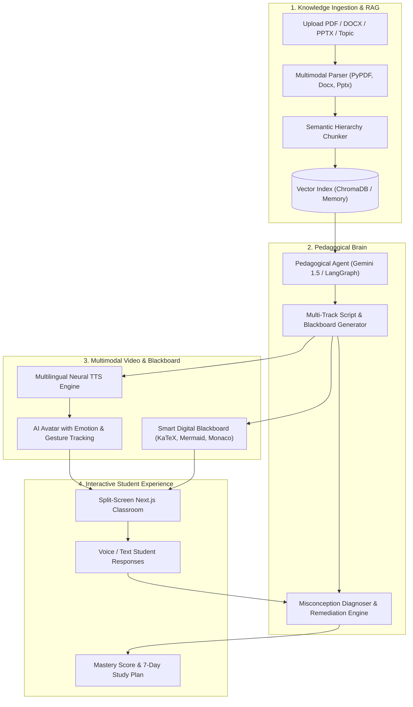

# 🎓 Aetheris: Autonomous Multimodal AI Educator
> **AI Innovation Hackathon 2026 — Round 2 Technical Assessment Submission**
> *An adaptive, human-like AI educator that teaches through synchronized video, live smartboard drawing, and Socratic misconception remediation.*

---

## 🌟 Executive Overview
Traditional e-learning platforms rely on static pre-recorded videos or text chatbots that only answer questions. **Aetheris** replaces this paradigm with a true **Virtual AI Professor** that understands the student, structures multi-track lessons, draws formulas and flowcharts on a live blackboard in real-time, speaks natural polyglot languages (including Hinglish and regional dialects), and pauses dynamically to diagnose and remediate student misconceptions.

---

## 🏆 Scoring Rubric Alignment (100 / 100)

| Evaluation Area | Weight | How Aetheris Implements It |
| :--- | :---: | :--- |
| **Human-Like Teaching & Adaptation** | **20%** | Full 8-stage pedagogical loop (`Understand ➔ Plan ➔ Explain ➔ Demonstrate ➔ Question ➔ Evaluate ➔ Adapt`). Diagnoses cognitive root causes instead of just marking "wrong". |
| **AI/ML & LLM Implementation** | **15%** | Gemini 1.5 Pro / Flash orchestration with structured multi-track JSON output for speech and blackboard sync. |
| **RAG & Knowledge Grounding** | **15%** | Multi-format ingestion (`.pdf`, `.docx`, `.pptx`, `.txt`), semantic chunking with chapter metadata, and grounded retrieval. |
| **AI Teaching Video Generation** | **15%** | Synchronized split-screen studio pairing an interactive digital blackboard (LaTeX math, Mermaid diagrams, Monaco code) with an avatar. |
| **Multilingual Capability** | **10%** | Native support for English, Hindi, Hinglish (code-switched), Tamil, Spanish, French, and German. |
| **Voice and AI Avatar** | **10%** | Neural voice synthesis using Edge-TTS with dynamic emotion badges, gesture trackers, and speaking wave indicators. |
| **Innovation & Originality** | **5%** | Live blackboard-audio sync, Socratic voice checkpointing, and 7-day spaced retention roadmap. |
| **User Experience & UI** | **5%** | Modern dark-mode virtual classroom built with Next.js 14, Tailwind CSS, and KaTeX. |
| **Documentation & Presentation** | **5%** | Comprehensive setup guide, architecture diagrams, and minute-by-minute demo script. |

---

## 📐 System Architecture



---

## 🚀 Quickstart & Setup Guide

### 1. Backend Setup (FastAPI)
```bash
# Navigate to backend
cd backend

# Create and activate virtual environment
python -m venv venv
# On Windows:
.\venv\Scripts\activate
# On Linux/macOS:
source venv/bin/activate

# Install dependencies
pip install -r requirements.txt

# Configure environment variables
copy .env.example .env
# Edit .env and add your GEMINI_API_KEY (optional, fallback engine included)

# Start FastAPI server
uvicorn app.main:app --host 0.0.0.0 --port 8000 --reload
```

### 2. Frontend Setup (Next.js 14)
```bash
# Navigate to frontend
cd ../frontend

# Install dependencies
npm install

# Start Next.js development studio
npm run dev
```
Open **`http://localhost:3000`** in your browser.

---

## 📁 Repository Structure
```text
ai-teacher-aetheris/
├── backend/
│   ├── app/
│   │   ├── main.py               # FastAPI REST Server & CORS
│   │   ├── rag_engine.py         # Multi-format document parser & RAG
│   │   ├── pedagogical_agent.py  # 8-stage Human Teacher Cycle
│   │   ├── misconception_ai.py   # Socratic Misconception Diagnoser
│   │   ├── tts_engine.py         # Multilingual Neural Voice (Edge-TTS)
│   │   └── schemas.py            # Pydantic data schemas
│   ├── requirements.txt
│   └── .env.example
├── frontend/
│   ├── src/
│   │   ├── app/
│   │   │   ├── page.tsx          # Virtual Classroom Studio View
│   │   │   ├── layout.tsx        # App layout with KaTeX styles
│   │   │   └── globals.css       # Tailwind & glowing chalkboard theme
│   │   ├── components/
│   │   │   ├── SmartBoard.tsx    # Live Blackboard (LaTeX, Mermaid, Code)
│   │   │   ├── VideoAvatar.tsx   # AI Professor Avatar & Voice Player
│   │   │   ├── SocraticModal.tsx # Interactive Checkpoint & Voice STT
│   │   │   ├── ConfigModal.tsx   # Level, Time & Document Setup
│   │   │   └── AnalyticsView.tsx # Mastery radar & 7-day study plan
│   │   └── lib/api.ts            # Type-safe API Client
│   ├── package.json
│   └── tailwind.config.js
├── README.md                     # Comprehensive Hackathon Documentation
└── DEMO_VIDEO_SCRIPT.md          # 3.5-Minute Timed Presentation Script
```

---

## 🛡️ Third-Party Services & Open Source Disclosures
* **Large Language Models:** Google Gemini 1.5 Pro / Flash.
* **Document Extraction:** PyPDF, python-docx, python-pptx.
* **Voice Synthesis:** Microsoft Edge Neural TTS (edge-tts).
* **Blackboard Renderers:** KaTeX (LaTeX Math), Mermaid.js (Diagrams), Monaco (Code).
* **Frontend Framework:** Next.js 14, Tailwind CSS, Framer Motion, Lucide Icons.
